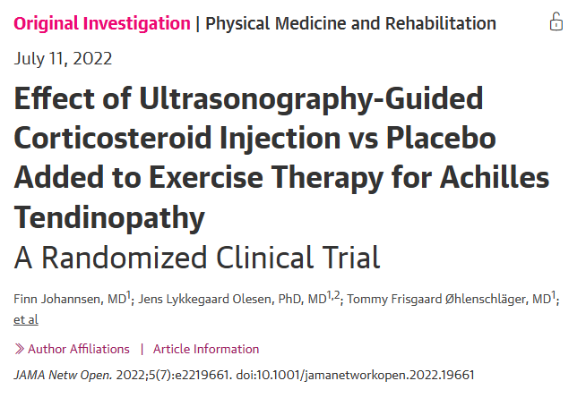
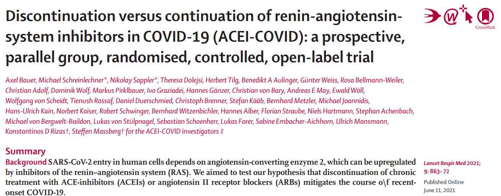

# Meta-Analysis Academy

## Ideias
* Beira do leito: dúvidas clínicas
* Professores/orientadores
* Estudos Randomizados
* "What's new?"
* Aulas
* Congressos
* Diretrizes (recomendações fracas)
* Análises de subgrupos
* Desfechos secundários

## Definir a Pergunta

* P - População 
* I - Intervenção
* C - Controle
* O - Outcome (Desfecho)
* T - Tipo de pergunta/estudo --> É terapêutico ou diagnóstico?
* T - Tempo de seguimento

Lembrar: `Olhar diretrizes da SBC para o congresso de cardiologia`

**Exemplo-1:**

[JOHANSSEN, F. _et al_. (2022)](https://jamanetwork.com/journals/jamanetworkopen/fullarticle/2794124)
* P - Pacientes, de 18-65 anos, com tendinopatia do aquileu.
* I - Injeção de corticoide (metilpredinisolona) guiado por USG + Exercício
* C - Placebo + Exercício
* O - Avaliação da dor com base na  Victorian Institute of Sports Assessment–Achilles (VISA-A) score (range, 1-100, with 100 representing no symptoms) em até 6 meses.
* T - Terapêutico
* T - 24 meses

## Viabilidade

Em relação a viabilidade da Meta-análise, dois aspectos principais devem ser levados em consideração. O primeiro, é o número de estudos que se enquadram na pergunta PICOT da pesquisa, sendo necessários **no mínimo 3 estudos** , com **pelo menos um desfecho em comum**, para a execução. 

Já o segundo aspecto, trata-se de ser um **estudo inédito**, uma pesquisa ainda não realizada/publicada. Nesse sentido, é importante uma busca na literatura para averiguar se aquele tema que havia sido pensado já não foi publicado. Dica! -> Incluir "meta-analysis" na chave de busca do PubMed. Contudo, mesmo de diante de uma ideia de meta-análise que já foi publicada, existem alternativas para o tornar a ideia inédita. Por exemplo:
* Aumentar o número de estudos e pacientes
* Focar em população diferente
* Estudos Randomizados
* Novas tecnologias
* Subgrupos

**Importante**: Sempre que houver uma meta-análise prévia com a mesma ideia a qual o autor tinha pensado, ele então deve relatar o porquê de está realizando um novo estudo estudo na mesma temática e quais a diferenças em relação aos que já foram publicados anteriormente.

**Exercício-1**:

[BAUER, A. et al. (2021)](https://pubmed.ncbi.nlm.nih.gov/34126053/
)

* P - Pacientes, > 18 anos, que tiveram COVID-19 recente e sintomática que fazem uso crônico de IECA ou BRA.
* I - Descontinuação do IECA ou BRA
* C - Continuação do IECA ou BRA
* O - SOFA Score em 30 dias (morte tem pontuação máxima no SOFA). Os desfechos secundários foram admissão em UTI, ventilação mecânica e morte.
* T - Terapêutico, RCT
* T - Sem restrições

Chave de busca: `("ACEI" OR "ACEI inhibitor" OR "ARB" OR "renin-angiotensin") AND (continuation OR discontinuation) AND ("SARS-COVID" OR "COVID-19" OR "COVID19") AND "meta-analysis"`

Na própria discussão do artigo podemos encontrar estudos randomizados que permitem a viabilidade da meta-análise, o BRACE CORONA, estudo brasileiro, e o REPLACE COVID. Somado ao ACEI-COVID, temos já 3 estudos que podem ser incluídos na meta-análise.

`DICA!! Sempre optar por incluir, se possível, somente estudos randomizados, pois evitar ter que fazer ajustes estatísticos posteriormente.`

## Estratégias de busca

Esse momento é muito importante, pois irá definir o principal substrato para a meta-análise, os estudos que serão incluídos. Para isso, é necessário que a estratégia de busca seja específica o suficiente para ter uma busca factível, contudo nem tão específica a ponto de restringir a busca e deixar passar estudos relevantes. Um aspecto importante é **não incluir desfechos nas chaves de busca**, pois os estudos têm inúmeros desfechos e podem restringir a busca.

Comece pelas palavras-chave de **população, intervenção e controle**. Além disso, use operadores booleanos e evite field tags ou filtros. Sempre utilizar o vocabulário controlado MeSH, no caso do PubMed, e utilizar aspas nas palavras compostas.

